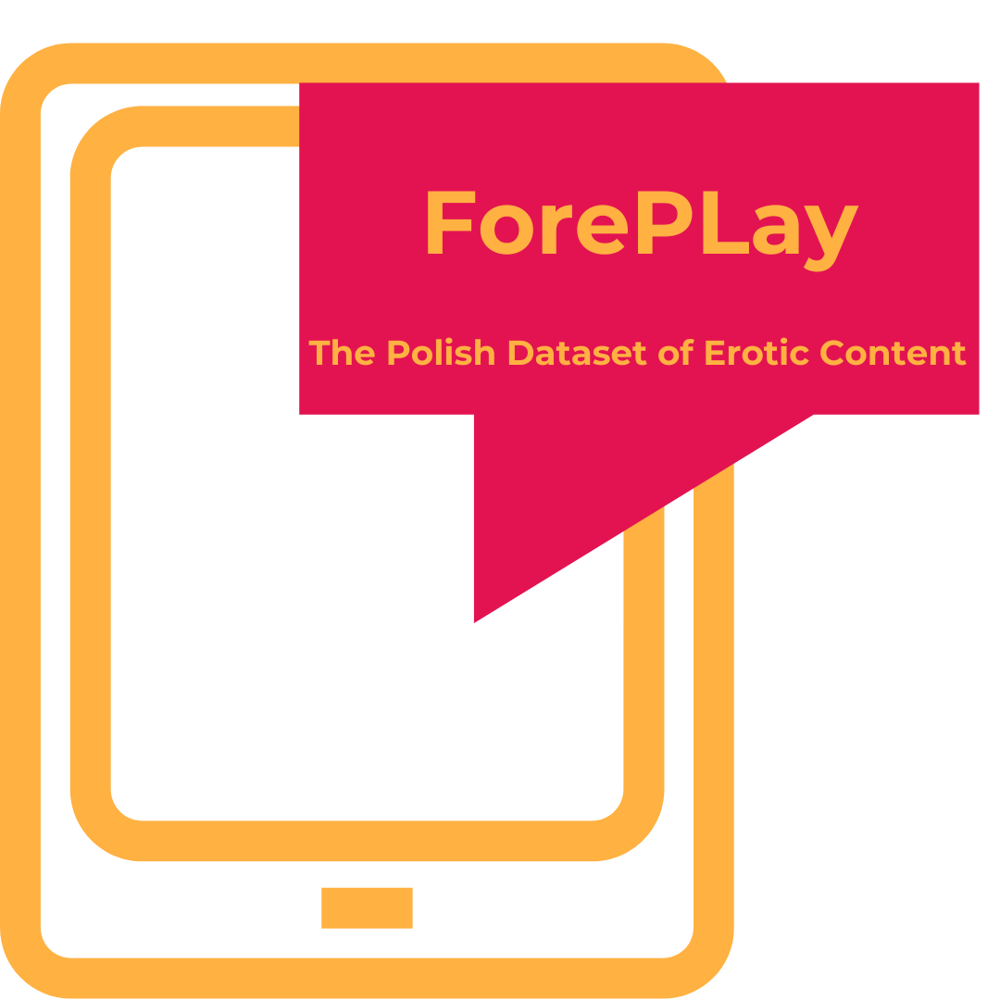

# ForePLay: The Polish Dataset of Erotic Content




We present **ForePLay**, a large-scale annotated corpus of Polish language content consisting of **24,583 sentences**. The dataset was systematically sampled from two primary sources:

1. **User-generated content** from online fiction repositories,
2. **Polish literary works**, including translations of world literature and LGBTQ+ literature.

## Annotation Process
The annotation process involved a gender-balanced team of 6 annotators. Each sentence was annotated by three annotators, employing majority voting. In cases of complete disagreement, a superannotation process resolved discrepancies.

### ForePLay Dataset Composition
- **6,361 sentences** labeled as “*erotic*”
- **1,344 sentences** labeled as “*ambiguous*”
- **16,878 sentences** labeled as “*neutral*”

For detailed annotation guidelines, refer to the accompanying publication:

[Behind Closed Words: Creating and Investigating the ForePLay Annotated Dataset for Polish Erotic Discourse](https://arxiv.org/pdf/2412.17533)

Please note that the released dataset does not include the minor classes outlined in the original data framework that pertain to sexual violence and socially unacceptable behaviors. Due to ethical considerations, we have chosen not to publish potentially harmful data.

---

## Citation
If you make use of this dataset, please cite the following paper:

```
Kołos, A., Lorenc, K., Wiśnios, E., Karlińska, A. Behind Closed Words: Creating and Investigating the ForePLay Annotated Dataset for Polish Erotic Discourse. 2024. arXiv:2412.17533.
```

---

## License
The dataset and code in the repository are made available under a [**Attribution-NonCommercial-NoDerivatives 4.0 International license**](https://creativecommons.org/licenses/by-nc-nd/4.0/deed.en).

---
