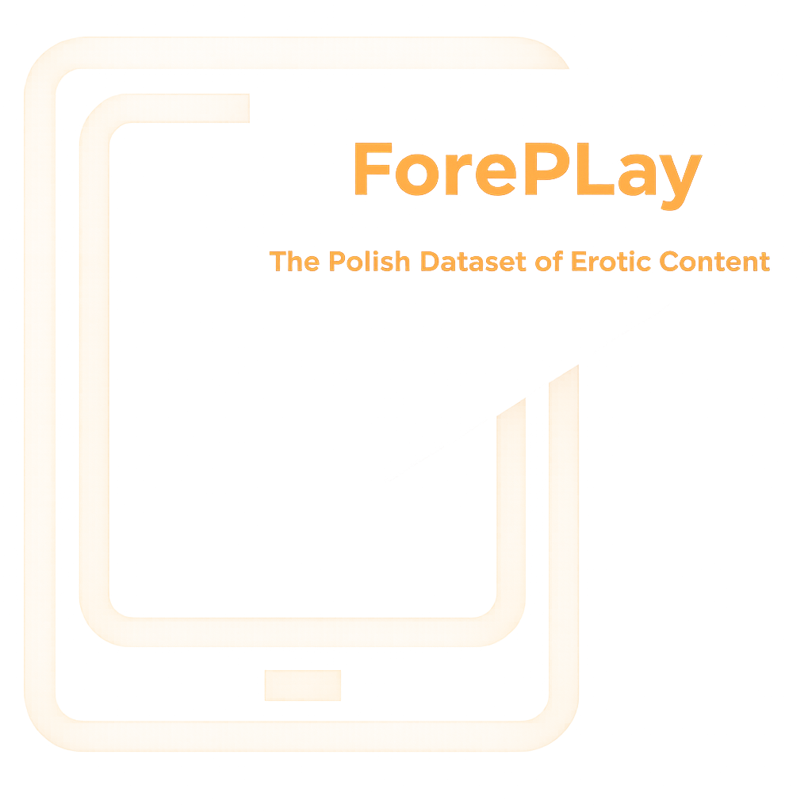

# ForePLay: The Polish Dataset of Erotic Content




We present **ForePLay**, a large-scale annotated corpus of Polish language content consisting of **24,583 sentences**. The dataset was systematically sampled from two primary sources:

1. **User-generated content** from online fiction repositories,
2. **Polish literary works**, including translations of world literature and LGBTQ+ literature.

## Annotation Process
The annotation process involved a gender-balanced team of 6 annotators. Each sentence was annotated by three annotators, employing majority voting. In cases of complete disagreement, a superannotation process resolved discrepancies.

### ForePLay Dataset Composition
- **6,361 sentences** labeled as *erotic*
- **1,344 sentences** labeled as *ambiguous*
- **16,878 sentences** labeled as *neutral*

For detailed annotation guidelines, refer to the accompanying publication:

[Behind Closed Words: Creating and Investigating the ForePLay Annotated Dataset for Polish Erotic Discourse](https://arxiv.org/pdf/2412.17533)

Please note that the released dataset does not include the minor classes outlined in the original data framework that pertain to sexual violence and socially unacceptable behaviors. Due to ethical considerations, we have chosen not to publish potentially harmful data.

## Release 1.0
A subset of erotic and ambiguous sentences, totaling **3,704 samples**, has been released. 
### ForePLay Dataset Release 1.0 Composition
- **2,728 sentences** labeled as *erotic*
- **976 sentences** labeled as *ambiguous*

This subset has undergone additional copyright verification and was made available following legal consultations. The released data and its license comply with new legal regulations that came into effect after the data collection and annotation process had been completed. The published dataset will be gradually expanded.


> ⚠️ **Content Warning**:  
> This repository contains a dataset that includes erotic and potentially sensitive textual content intended strictly for research purposes. It is recommended for use by individuals aged 18 and older.  
> The content has been annotated and curated in accordance with legal and ethical guidelines, and it is intended to support research on content moderation, natural language processing, and harmful content detection.


---

## Citation
If you make use of this dataset, please cite the following paper:

```
Kołos, A., Lorenc, K., Wiśnios, E., Karlińska, A. Behind Closed Words: Creating and Investigating the ForePLay Annotated Dataset for Polish Erotic Discourse. 2024. arXiv:2412.17533.
```

---

## License
The dataset and code in the repository are made available under a [**Attribution-NonCommercial-NoDerivatives 4.0 International license**](https://creativecommons.org/licenses/by-nc-nd/4.0/deed.en).

---
